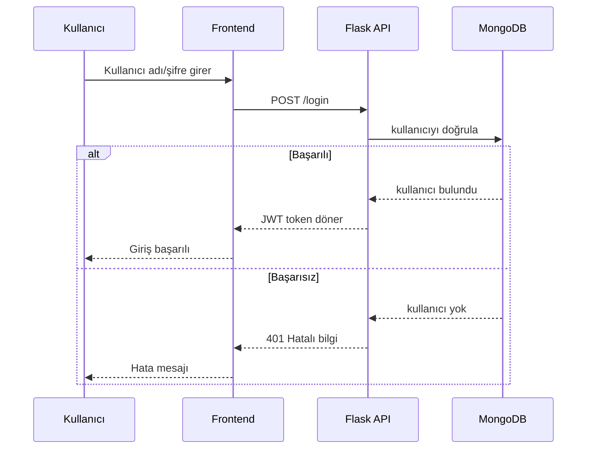

# YMG Final Ödevi - Basic Login API (Docker + MongoDB + JWT)

Bu proje **Flask** tabanlı basit bir API uygulamasıdır. Proje, final ödevindeki maddeleri tek bir uygulama içinde karşılayacak şekilde hazırlanmıştır.

## Çalıştırma

```bash
docker-compose up --build
```

- Backend (API): `http://localhost:8000`
- Swagger UI: `http://localhost:8000/apidocs/`
- Frontend: `http://localhost:8080`

## Endpointler

### Public (Token gerektirmez)
- `GET /status` → servis ayakta mı?
- `GET /public-data` → örnek dış API çağrısı (JSONPlaceholder)
- `POST /register` → kullanıcı kayıt (MongoDB)

### Login (Token üretir)
- `POST /login` → kullanıcı adı/şifre ile giriş ve JWT üretimi  
  Varsayılan kullanıcı: `admin / 12345`

Örnek istek:
```bash
curl -X POST http://localhost:8000/login \
  -H "Content-Type: application/json" \
  -d '{"kullanici_adi":"admin","sifre":"12345"}'
```

### Protected (Bearer token gerektirir)
- `GET /profile` → JWT doğrulaması ile çalışır

Örnek istek:
```bash
curl http://localhost:8000/profile \
  -H "Authorization: Bearer <TOKEN>"
```

## MermaidJS Diyagramı (Login Akışı)



## AI Güvenlik ve İyileştirme Önerileri (Bonus)

1. JWT secret değeri `.env` üzerinden yönetilmeli ve repoya yazılmamalı.
2. Şifreler düz metin tutulmamalı, `bcrypt` gibi bir algoritma ile hashlenmeli.
3. Rate limiting (ör. `/login` için) eklenerek brute-force saldırıları azaltılmalı.
4. Input validation genişletilmeli (eksik alanlar, tip kontrolleri, uzunluk sınırları).
5. Production ortamında HTTPS zorunlu yapılmalı ve güvenli CORS politikası uygulanmalı.
